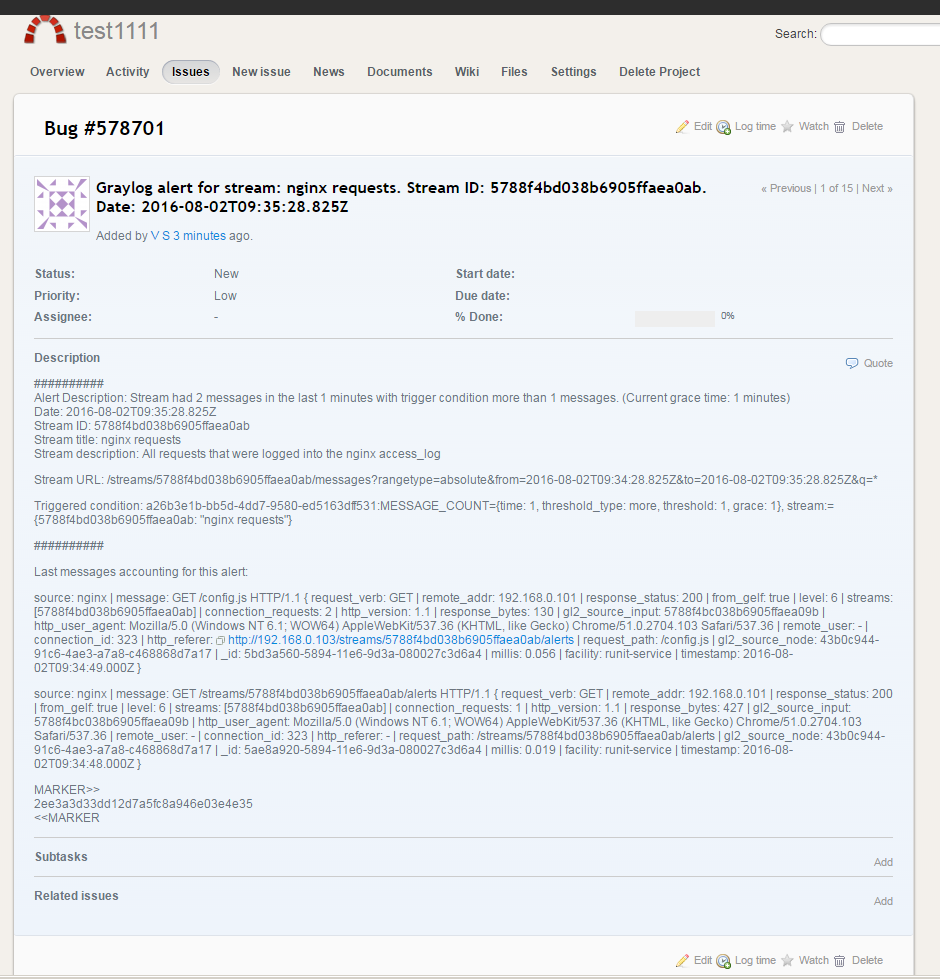

# Redmine Plugin for Graylog

[](https://travis-ci.org/sidvi1/graylog-redmine-plugin)
[](https://coveralls.io/github/sidvi1/graylog-redmine-plugin?branch=master)
[](https://www.versioneye.com/user/projects/57a0748772d75c0051b3a1f6)
[](https://codebeat.co/projects/github-com-hamster21-minion)
[](http://badges.mit-license.org)


Graylog alarm callback plugin for Redmine issue tracker.

**Required Graylog version:** 2.0 and later

Installation
------------
**NOTE: Currently this plugin conflict with graylog-map-widget-plugin and any other plugins bundle `org.apache.httpcomponents.httpclient`.
Before install remove graylog-map-widget-plugin from `plugins` directory.**

[Download the plugin](https://github.com/sidvi1/graylog-redmine-plugin/releases)
and place the `.jar` file in your Graylog plugin directory. The plugin directory
is the `plugins/` folder relative from your `graylog-server` directory by default
and can be configured in your `graylog.conf` file.

Restart `graylog-server` and you are done.

Usage
-----
In the fields subject and description can use templates.
As a template engine used [jmte](https://code.google.com/archive/p/jmte/wikis/GettingStarted.wiki).

Example subject: 
```
Graylog alert for stream: ${stream.title}. Stream ID: ${stream.id}. Date: ${check_result.triggeredAt}
```

Example description:
```
##########
Alert Description: ${check_result.resultDescription}
Date: ${check_result.triggeredAt}
Stream ID: ${stream.id}
Stream title: ${stream.title}
Stream description: ${stream.description}
${if stream_url}Stream URL: ${stream_url}${end}

Triggered condition: ${check_result.triggeredCondition}

##########
${if backlog}
Last messages accounting for this alert:
${foreach backlog message}
${message}
${end}
${else}
<No backlog>
${end}
```


Available template parameters:
- stream
- backlog
- backlog_size
- stream_url
- check_result
- alert_condition

Screenshots
-----
Plugin configuration form


Sample alert configuration


Redmine task received from graylog


Copiright
------
Plugin based on some code EmailAlarmCallback plugin.
Inspired by [graylog-jira-alarmcallback](https://github.com/magicdude4eva/graylog-jira-alarmcallback)
Copyright (c) 2016 Vitaly Sidorov. See LICENSE for further details.
